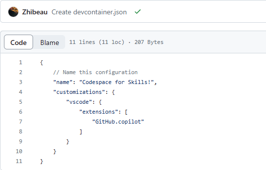

# One sentence to introduce GitHub Copilot:
*Created by OpenAI, GitHub Copilot's generative pretrained language model draws context from comments and code to suggest individual lines and whole functions instantly.*

# Learning goals:
- Its advantages
- Availabitity for individuals and businesses
- Copilot X
- Its configurations
- Develop GitHub Copilot with VSC

# Trends since the launch of GitHub Copilot:
- 46% of new code is now written by AI
- 55% faster overall developer productivity
- 74% of developers feel more focused on satisfying work

# What will the GitHub Copilot X bring:
- A ChatGPT-like chat interface for code analysis, test generating, and bug fixing
- Help pull requests
- AI-generated answers about documentation
- Help compose commands, loops, flags in CLI

# What will the GitHub Copilot Business bring:
- A more powerful AI model (Maybe like GPT4 to GPT3).
- **AI-based security vulnerability filtering**: GitHub Copilot automatically blocks common insecure code suggestions by targeting issues such as hardcoded credentials, SQL injections, and path injections.
- VPN proxy support
- Simple sign-up

# My exposure to GitHub Copilot:
Firstly, we need to add a configuration file in the repository:



After install the Copilot extension in VSC, we use it during coding, here are some solutions suggested by copilot:


You can press tab to apply the solution.

Sometimes the solution is generating, you can press ```ctrl+enter``` to open another text file that contains the solution and will keep freshing till all the solutions are generated. Then you can choose one among them:


